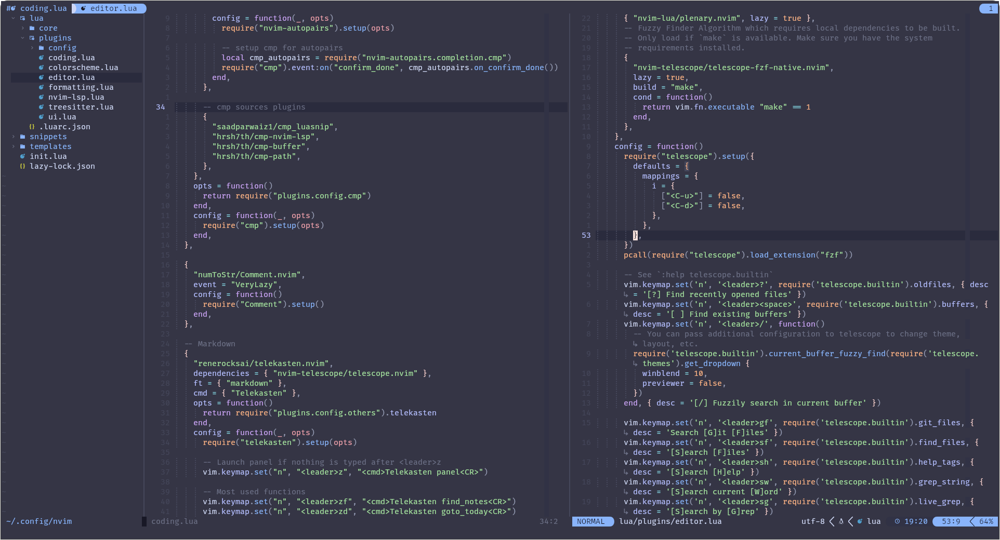
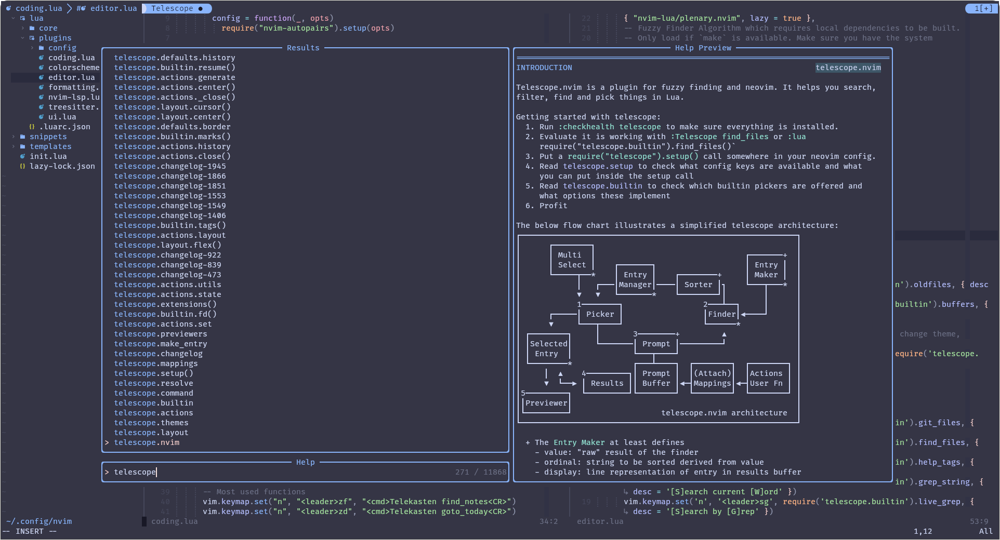
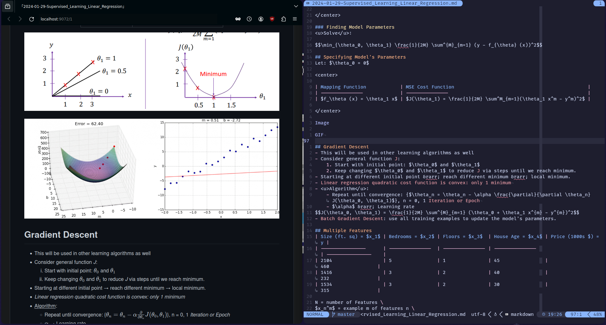

<span style="font-size: 20px;">

```
0x000000: 05 f1 07 79 e8 59 a2 a5 c8 91 eb f1 77 9a 55 4b  ...y.Y......w.UK
0x000010: a8 dd d8 75 89 00 4c d2 79 93 39 0d 7c c9 19 81  ...u..L.y.9.|...
0x000020: 00 00 00 00 00 00 00 00 00 00 00 00 00 00 00 00  ................
0x000030: 48 69 20 f0 9f 91 8b 2c 20 49 27 6d 20 52 6f 62  Hi 👋, I'm Rob
0x000040: 65 72 74 20 42 69 6e 67 68 61 6d 00 00 00 00 00  ert Bingham.....
0x000050: 00 00 00 00 00 00 00 00 00 00 00 00 00 00 00 00  ................
0x000060: ba 20 fb a2 79 9d 48 41 2e 33 33 a5 cd 88 f0 75  . ..y.HA.33....u
0x000070: 65 c8 eb ef c8 37 c1 42 ca fa 4f 46 c3 68 c8 7e  e....7.B..OF.h.~
```

</span>

I am a college student currently working towards my Bachelor's in the Department of Computer Science at [Tennessee Tech University](https://www.tntech.edu/) with an emphasis on Data Science. 

I'm an avid competitor of the [International Collegiate Programming Contest](https://icpc.global/) where students across the globe compete in an intense contest to solve real-world problems. I'm also a member of the [Data Science League](https://www.tntech.edu/engineering/programs/csc/data-science-league.php) here at Tennessee Tech University where we apply data science techniques to collect data, analyze data, and create models to predict data.

<h2 align="center">💻 Tech Stack</h2>

#### Programming Languages
<center>


</center>

#### Frameworks
<center>


</center>

#### Tools
<center>


</center>

<h2 align="center">👩‍💻 IDE</h2>

<a href="https://github.com/Rbbingham/dotfiles/">
    
</a>





<h2 align="center">📊 Stats</h2>

[](https://github.com/ryo-ma/github-profile-trophy)

<h2 align="center">🗂️ Highlight Projects</h2>

<a href="https://github.com/Rbbingham/CSC-4610-Capstone">
  
</a>

<h2 align="center">⌨️ Competitve Programming 💻</h2>


